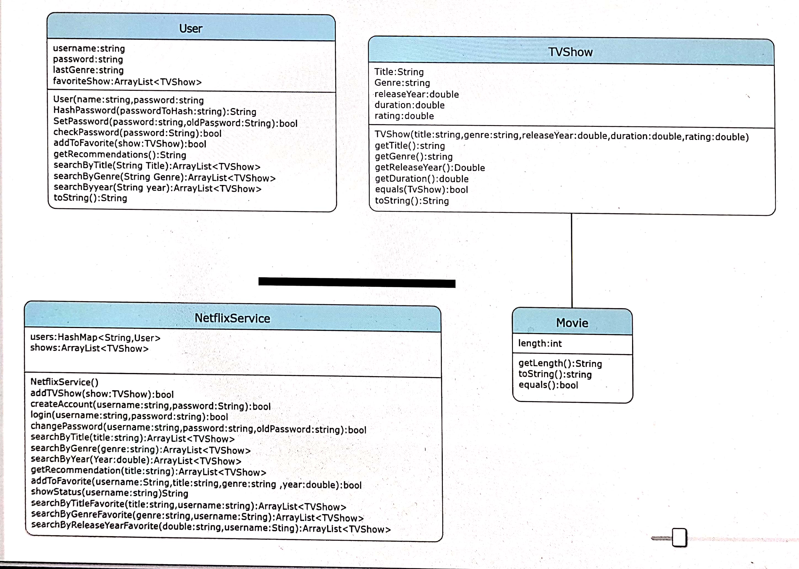

## *In the name of GOD*
## *fourth assignment report*

# Intrduction
this is a program to simulate a simple version of Netflix service.
it was done through OOP principles.
but don't have a database or work via files.

# Design and Implementation

### Design four principal objects 
- User
- TVShow
- Movie
- NetflixService

### Now see the object information

### Functions that need an explanation
- **User.hashpassword** :
    uses the **MD5** algorithm to hash passwords that are  a secure way to save passwords in the database
    when the program wants to check the password, hashes an input password and then compares it with the hash string that was stored before.
- **NetflixService.login** :
  Checks the existence of the user and the validity of the password.
  for search, a show in the favorites or in the list of movies first gets desired input According to the information, finds shows that have that Property and puts them into an ArrayList, and then returns them.
- **NetflixService.showStatus**:
  gets the information of the user by calling the toString method of that user.
- for User, TV Show, the movie has `toString` methods to easily returns the user or, TV Show information as a string so can print them or use them in other cases.
- the program offers recommendations to the user according to its last show genre. This is a reasonable method that applies to most people most of the time.
-  This program uses swing GUI to get input and show outputs. this function `JOptionpane()` creates a new window and does some stuff.
- Implements encapsulation to protect data. so initials almost every variable to private mode so can access them only with that class method. but if initials a variable public it can be changed anywhere and can't check the validity of the data or can be dangerous for important data.
- In each function, for each action, the necessary logical conditions for the inputs are checked first, and then the given command is performed
# Testing and Evaluation:
to the program login via the admin and user and test every function that we have in our program.
the several problems were found almost are simple problem that was solved by a few lines.
like when entering the wrong username the program crashed because can't search.
like when entering the wrong username the program crashed because can't search.
to solve this problem added an if condition to the `login()` method in NetflixService class to check whether a username exists or not.

# Conclusion:

with the help of this program, we can meet the needs of an online platform to manage.
but this program needs a more beautiful user interface and a strong database or and web programming to can be used in practical conditions.
